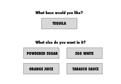

# Drinks Database

In this assignment, I'm using the database of The CocktailDB (https://www.thecocktaildb.com/) to create a drink selection website, where users can select their preferences and a drink will be given to them. 

## Style/Design

I wireframed the interface, where users would choose a liquor base (in this case, it's tequila - hoping to add more bases in the future) and one ingredient they wanted in the cocktail. 




## Development

The first step was to filter by tequila drinks. I chose the database to search through by name (https://www.thecocktaildb.com/api/json/v1/1/search.php?s=tequila). The database had a lot of information, so to clean it up a bit - I got rid of the "null" values and as suggested by my brother, a computer science major, to create one field for ingredients. It would be hard to parse through the ingredients to find one ingredient each drink had a different "strIngredient1", "strIngredient2", "StrIngredient3", etc. Then, I stored it in a file drinks.json

Old Database


New Database


I created a nedb database called tequila.db, where I logged the tequila drinks. To query the database for specific ingredients I used db.find({strIngredient: /Ingredient/}, for example I did db.find({strIngredient: /Powdered sugar/}, to find the tequila drink with powdered sugar. 

On the client side, I wanted the drink to show up on a button click. Once the user chose tequila, they could choose between "powdered sugar" or "egg white". When choosing the egg white button, I would make a fetch request to the server side. The server side queries the data base to find the ingredient I wanted, and the field is "strDrink" for ingredient and strDrinkThumb for image. Originally, I was trying to access the json file as data3.strDrink and was getting undefined. On closer look, "drinks.json" is an array of objects so I updated it to data3[0].strDrink. I did a console.log to check I was getting the right data and then added it the html. 

```
button3.onclick = async function printSomething3() {
    const response = await fetch("/getsugar");
    const data3 = await response.json();
    console.log(data3[0].strDrink);
    text3.innerHTML = `Your Drink: ${data3[0].strDrink}`;
    imageholder.src = data3[0].strDrinkThumb;
}
```

## General Questions

Overall, I think it's still taking time to understand the differences between client, server, database. I had to distinguish that the client can't make calls to the database to access information. 

I used "db.insert" to add to the tequila.db database, but commented it out to stop inserts every time I ran the server. Is there a way to stop inserts without commenting it out?

## Acknowledgements

* CocktailDB (https://www.thecocktaildb.com/)
* Chris Lee
* Cassie Tarakajian


