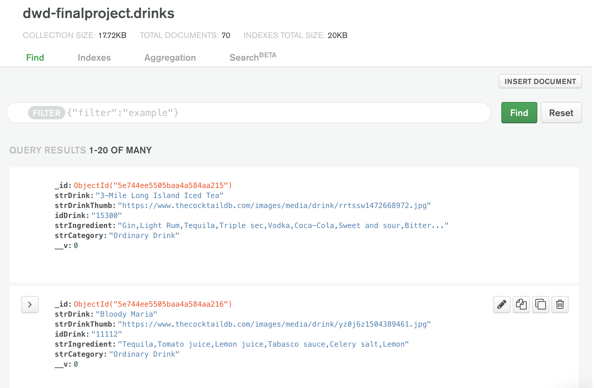

# Virtual Bartender 

I wanted to create a simulation of the bartender's choice online. Users select their preferences for a cocktail, and they are given a cocktail that matches that criteria. The preferences are for a liquor base, cocktail type and a fruit. I'm using the open, crowd-sourced database from CocktailDB(https://www.thecocktaildb.com/) for drink information. 

# Technologies 
* Node.js
* Express.js
* Mongoose
* MongoDB Atlas 
* Heroku 

# Style/Design

In bartender's choice, the orderer tells the bartender his/her preferences and/or feelings and the bartender makes an off-menu cocktail. I wanted to translate this experience digitally and studied the CocktailDB dataset. Within the API were ingredients and category per drink, so thought I would form suggested preferences based on those name value pairs.

For users to choose one option within a question, I had to think of the UI. Radio buttons were perfect, because they only allow you to click one option per question. I looked into creative radio buttons and came across this website (https://freefrontend.com/css-radio-buttons/). So, I wireframed a few options and asked people which one was most intuitive. I ended up going with the card radio buttons. 


I would like to credit Ivan Grozdic for inspiration for the final CSS (https://codepen.io/ig_design/pen/dLNKgM).

# Development
## Database

In CocktailDB, there are various ways to search for drink information(ex:name, ingredient, etc). My first question was for users to choose their liquor base so I searched by name in the CocktailDB API,(ex: drinks with "Tequila" in the name). (https://www.thecocktaildb.com/api/json/v1/1/search.php?s=tequila). This search only gave me 5 tequila drinks, so I used the other search options by searching by ingredient, finding the unique ID of each drink and searching for all the drink's attributes using the unique ID. So, it actually ended up being quite manual to add all the drinks to my database. The JSON file in CocktailDB also had a lot of information, so to clean it up I deleted the "null" values and created one field for all ingredients. CocktailDB had "strIngredient1", "strIngredient2", which would be hard to parse through each one if I were to query for one specific ingredient. At the end, I created a my own JSON file filed with all my drinks called drinks.JSON. 
 
Old Database


 
New Database


To create my database and deploy it to the web, I used Mongoose and MongoDB Atlas. I created a file called db.js for my database. I used a schema in Mongoose to define the shape of my documents within that collection. This corresponded with the array of objects in drinks.JSON file.

```
const DrinkSchema = mongoose.Schema({
 strDrink: {type: String},
 strDrinkThumb: {type: String},
 idDrink: {type: String},
 strIngredient: {type: String},
 strCategory: {type: String}
 });
```
 
Then, I deployed my database to MongoDB Atlas.

```
const Drink = mongoose.model("Drink", DrinkSchema);
const content = fs.readFileSync("drinks.json");
let drinksObj = JSON.parse(content);
let tequilaDrinks = drinksObj.drinks;
 
Drink.insertMany(tequilaDrinks, (err, docs) =>{
  console.log(docs);
});
```




<br />
<br />


## QUERYING THE DATA

On my server side, to access the database I’m using a GET request. I set up my route with my parameters - alcohol, type, fruit. On my client side, to create my parameters - I first created empty strings for variables alcohol, type and fruit. Each time a user clicks one preference, for example vodka, the variable would get updated to vodka for alcohol. 
 
Eventually, once all variables are updated, users click on “Find My Button” on the client side, sending a fetch request with the URL to the server side. 

Server Side 
```
app.get('/gettotal/:alcohol/:type/:fruit', (req, res) => {
    Drink.find({$and: [{strIngredient: new RegExp(req.params.alcohol)}, {strCategory: new RegExp(req.params.type)}, {strIngredient: new RegExp(req.params.fruit)}]}, (err,drinks) => {
        res.json(drinks);
    });
});
```

Client Side
```
let alcohol = ""
let type = ""
let fruit = ""

const tequilaRadio = document.getElementById("Tequila");

tequilaRadio.onclick = async function showTequilaValue() {
    if(tequilaRadio.checked) {
        alcohol = "Tequila";
    }
} 

submitbutton.onclick= async function displayRadioValue() {
    const response = await fetch("/gettotal/" + alcohol + "/" + type + "/" + fruit);
    const data = await response.json();
}
```

<br />


Two issues I ran into : 
1. My querying on the server side didn't work initally. 
2. My URL was not working, because of synchronous issues 

To solve the first issue, I had to use mongoose specific language. Originally, I had Drink.find({$and: [{strIngredient: req.params.alcohol}, {strCategory: req.params.type}, {strIngredient: req.params.fruit}]}, (err,drinks). It didn't work, because all my ingredients were in one string, so I had to separate my ingredients in substrings with new RegExp. 

For the second issue, originally, I put all my functions to update variables and the fetch request within the submit button. However, on button pressed, I got an error saying my URL didn't exist.


The fetch request worked when I put it after the variable for alcohol had been updated. 


So, it seemed to be a synchonous issue. So, I created asynchronous functions for each value - for tequila,vodka, lime, lemon, etc all outside the submit button. So, all the values of the variable would be created and then, I would submit my fetch request when the submit button was clicked. 
 
```
tequilaRadio.onclick = async function showTequilaValue() {
    if(tequilaRadio.checked) {
        alcohol = "Tequila";
        console.log("hello");
    }
} 

classicRadio.onclick = async function showClassicValue() {
    if(classicRadio.checked) {
        console.log("hello");
        type = "Ordinary Drink";
    }
}  
.
.
.
submitbutton.onclick= async function displayRadioValue() {
    //one fetch request at the end
    const response = await fetch("/gettotal/" + alcohol + "/" + type + "/" + fruit);
    const data = await response.json();
}
```

<br />

# Next Steps

I would like to expand the database. Some combinations of the variables were more popular than others ex: tequila + classic + lemon had more results than gin + surprise + orange. So, I added in some drinks not from cocktaildb that I found online. 

Since users have 3 options, it's not too hard to choose a combination of all three. However, I'm thinking if users only want tequila drinks or if the list of preferences become bigger (ex: adding soda as another preference), users might not click all three options. My route is set up that users have to click all 3 options for a drink to return. So, I would either have some error handling to indicate users need to select all options or find a way to handle only having a select number of preferences. 
 

# Acknowledgements

* CocktailDB (https://www.thecocktaildb.com/)
* Cassie Tarakajian
* Chris Lee
* Tianxu Zhou 
* Vince Shao 
* Ivan Grozdic (https://codepen.io/ig_design/pen/dLNKgM)
* Freefrontend.com (https://freefrontend.com/css-radio-buttons/)


